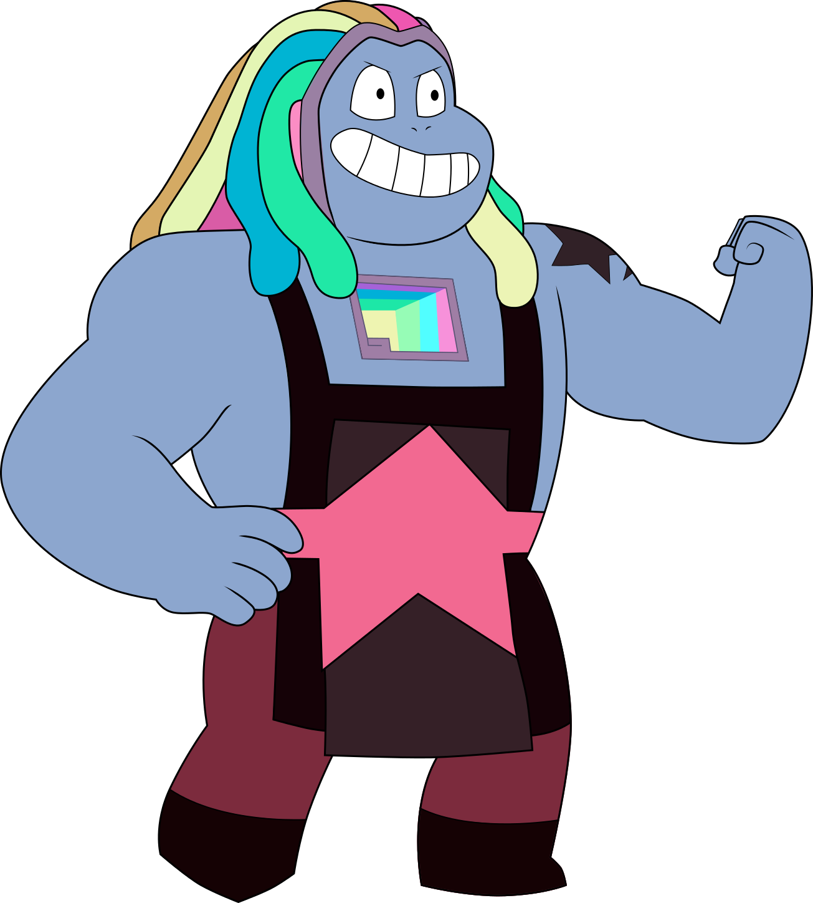

<p align="center"><em>your mind is for having ideas, not for holding them, not for executing them</em></p>

# bismuth

A GTD agentic system. Five agents, four tools, one memory folder.
# Bismuth


[MEMEX](https://en.wikipedia.org/wiki/Memex) using LLMs.  

Vannevar Bush wrote about concept of memex after world war 2; when a mini mechanical revolution had created very reliable tools.
Memex is a machine he envisioned that works as an external brain for humans. Memex looks like a big furniture piece, half room size with a desk. The desk has buttons, screens, levers, a typewriter; and the other end of the Memex is a huge storage box. The storage box saves content in microfilm and mechanically processes it. It takes in any number of premises and churns out conclusions. If the user wishes to consult a certain book, he clicks and the book appears before him on one of the screens. There are special buttons to skip to the next chapter, and to skip to the next book.

## Implementation with LLMs
original memex had two interacting units. brain and storage system.
i have three. brain, storage and LLM.

This repo is a llm layer. I interacte with this agent, ask it to implement some of my projects which could be done using terminal, code, browser and report back and log the results. At core, this repo is instructions to LLM on how to organise information + code for tools LLM need to use terminal, execute code, use browser.

## Structure

```
home/
├── agents/
│   ├── capture.py        runs continuously, listens to Telegram
│   ├── clarify.py        runs every 1 hour, routes capture.md
│   ├── project.py        run manually per project
│   ├── coffeechat.py     run manually per project for planning
│   └── evaluation.py     run manually once a week
├── tools/
│   ├── telegram.py
│   ├── terminal.py
│   ├── browser.py
│   └── transcribe.py
├── prompts/
│   ├── capture.md
│   ├── clarify.md
│   ├── project.md
│   ├── coffeechat.md
│   └── evaluation.md
├── memory/               created at runtime by the agents
│   ├── capture.md
│   ├── capture/              media files (photos, videos, voice)
│   ├── nexttodo.md
│   ├── delegate.md
│   ├── deferred-todo.md
│   ├── calendar.md
│   ├── tracking.md
│   ├── reference/
│   │   └── register.md
│   ├── project_1_name/
│   │   ├── vision.md
│   │   ├── nexttodo.md
│   │   ├── tracking.md
│   │   └── support/
│   ├── project_2_name/
│   └── ... other projects
├── run.sh
└── config.yaml
```

## Setup

1. Install app dependencies: `brew bundle` (installs Pulsar)
2. Install Python dependencies: `pip install anthropic faster-whisper requests pyyaml`
3. Install browser: `npm install -g silicon-browser && silicon-browser install`
4. Log in to sites once: `silicon-browser --profile silicon open <url>`
5. Fill in `config.yaml` — add `ANTHROPIC_API_KEY`
6. Create `memory/<project>/vision.md` for each project

## Running

```bash
./run.sh                                  # starts capture + clarify
python agents/project.py <project_name>   # run a project agent
python agents/coffeechat.py <project_name>  # run a coffeechat planning session
python agents/evaluation.py              # weekly report
```

## Bismuth's Stuff


